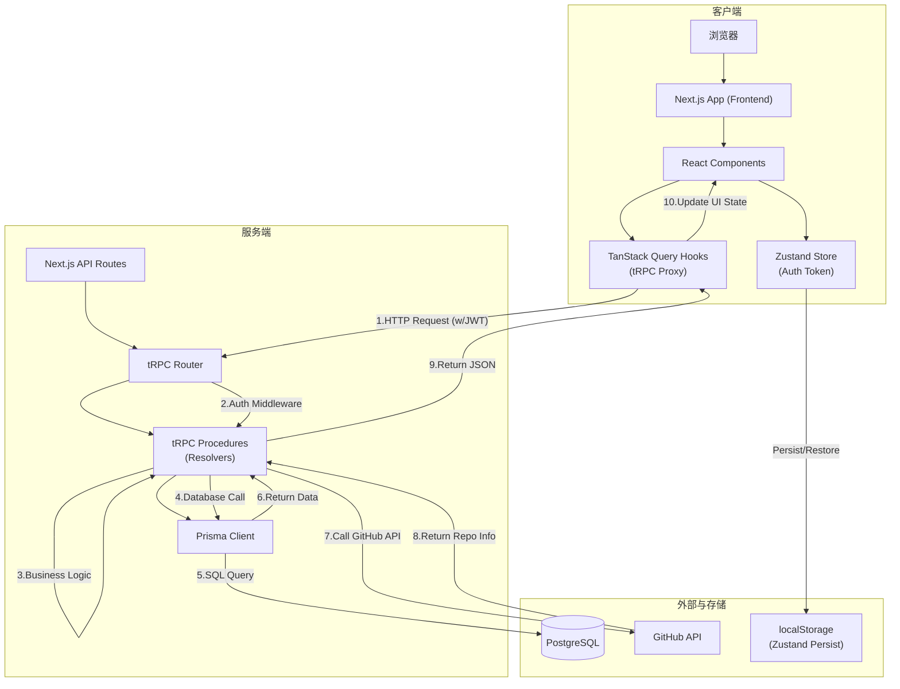

## **RepoVault (T3 Stack) 系统设计文档**

### 1. 引言

本文档详细阐述了 RepoVault 项目在 `tech/t3-stack` 分支下的系统设计方案。该方案基于 T3 Stack 的核心哲学，利用其类型安全的特性，构建一个高效、可维护且开发体验极佳的全栈应用。我们将深入探讨技术选型、整体架构、数据库、后端、前端的实现细节，并特别说明如何通过 **Model Context Protocol (MCP)** 集成 AI Agent，以进一步提升开发效率。

### 2. 技术栈选型与优势

本方案选择了一套高度协同的现代化技术栈，旨在最大化开发效率和代码质量。

| 技术                       | 用途             | 优势与特点                                                                                               |
| :----------------------- | :------------- | :-------------------------------------------------------------------------------------------------- |
| **Next.js (App Router)** | 全栈 React 框架    | 提供服务端渲染 (SSR)、静态站点生成 (SSG) 和 API 路由。App Router 带来了更直观的布局、嵌套路由和服务器组件，性能和 SEO 表现优异。                   |
| **tRPC**                 | 端到端类型安全的 API 层 | **核心优势**：消除了传统 REST API 的运行时错误。从后端 `router` 到前端 `useQuery`，整个数据流共享同一套 TypeScript 类型，实现真正的“端到端类型安全”。 |
| **PostgreSQL**           | 关系型数据库         | 功能强大、稳定可靠，支持复杂查询和事务。与 Prisma 结合，能充分发挥其类型安全优势。                                                       |
| **Prisma**               | 下一代数据库 ORM     | 提供类型安全的数据库访问、自动生成的客户端、直观的 Schema 定义和简单的数据迁移。极大减少了数据库操作的样板代码和潜在错误。                                   |
| **TanStack Query**       | 服务端状态管理        | 强大的异步状态管理库。它不仅仅是数据获取，还处理缓存、后台更新、失效和请求重试等复杂逻辑，让 UI 与服务端状态保持同步变得极其简单。                                 |
| **Zustand**              | 客户端状态管理        | 一个轻量级、无样板代码的状态管理库。非常适合管理全局的、纯粹的前端状态，如用户认证信息和 UI 主题。                                                 |
| **Tailwind CSS**         | 原子化 CSS 框架     | 通过 utility-first 的方式快速构建自定义 UI，无需离开 HTML。高度可定制，能有效保持设计的一致性。                                         |
| **shadcn/ui**            | 高质量 UI 组件库     | 基于 Radix UI 和 Tailwind CSS 构建，提供了一系列可访问、可定制、可复制的组件。它不是一个 `npm install` 的库，而是将组件源码引入项目，拥有极高的灵活性。     |
| **React Bits**           | 可复用组件与逻辑集合     | 一个精选的、可复用的 UI 组件、Hooks 和模式的集合。我们遵循其哲学，在项目中构建和封装可复用的逻辑（如自定义 Hooks）和组件，以加速开发并保持代码一致性。                 |

### 3. AI Agent 集成

为了充分利用 AI 辅助编程，本项目集成了 **Model Context Protocol (MCP)**。MCP 是一个开放协议，允许 AI 助手（如 Claude, GitHub Copilot）安全地连接到数据源和工具，使其能深刻理解项目上下文，提供更精准的代码建议和自动化支持。

我们通过项目根目录下的 `mcp.json` 文件来配置 MCP 服务器。

**`mcp.json` 配置示例**:

```json
{
  "mcpServers": {
    "shadcn-ui": {
      "command": "npx",
      "args": [
        "@shadcn/ui@latest",
        "mcp"
      ]
    },
    "reactbits": {
      "command": "npx",
      "args": [
        "@reactbits/dev@latest",
        "mcp"
      ]
    },
    "prisma": {
      "command": "npx",
      "args": [
        "@prisma/mcp-server",
        "--schema-path=./prisma/schema.prisma"
      ]
    }
  }
}
```

**配置说明**:

*   **`shadcn-ui`**: 允许 AI 访问 `shadcn/ui` 的完整组件库文档和用法，使其能智能地建议使用、修改或创建符合项目风格的组件。
*   **`reactbits`**: 为 AI 提供了 `reactbits.dev` 丰富的组件和模式库，扩展了 UI/UX 解决方案的选项。
*   **`prisma`**: **至关重要**。此服务器让 AI 能够直接理解数据库模式、表关系和字段类型，从而在生成 tRPC 流程、数据库查询或前端类型时做到完全准确。

通过这些 MCP 配置，AI Agent 不再是一个孤立的代码补全工具，而是一个深度融入项目、理解项目架构的“虚拟开发伙伴”。

### 4. 整体架构设计

我们的架构以**类型安全**为核心，数据流单向且可预测。



**架构解读**:

1.  **数据流**: 用户交互触发 React 组件中的事件。
2.  **状态管理**:
    *   **客户端状态** (如认证 Token) 由 `Zustand` 管理，并持久化到 `localStorage`。
    *   **服务端状态** (如仓库列表) 由 `TanStack Query` 管理。它通过 `tRPC` 客户端发起请求。
3.  **API 层**: `tRPC` 客户端将请求发送到 Next.js 的 API 路由。`tRPC` 服务器接收到请求后，通过认证中间件验证用户身份，然后调用相应的 `procedure`。
4.  **数据访问**: `procedure` 中的业务逻辑通过 `Prisma` 客户端与 PostgreSQL 数据库进行类型安全的交互。
5.  **类型安全**: 从 `Prisma` 的 `Schema`，到 `tRPC` 的 `Router`，再到前端的 `useQuery` 钩子，TypeScript 类型贯穿始终，确保了数据结构的一致性。

### 5. 数据库设计

我们使用 **PostgreSQL** 作为主数据库，并通过 **Prisma** 进行 ORM 管理。

**技术选型理由**:
*   **PostgreSQL**: 提供了强大的关系模型和事务支持，`@@unique` 约束能完美实现“防止用户重复收藏”的业务规则。
*   **Prisma**: 其类型安全的客户端和 `upsert` 操作，使得与数据库的交互既安全又简洁。

**实现细节**:
数据库 Schema 定义在 `prisma/schema.prisma` 文件中，包含三个核心模型：

*   **`User`**: 存储用户信息，包含 `username` 和 `passwordHash`。
*   **`Repo`**: 存储从 GitHub 抓取的仓库信息，以 `githubId` 作为唯一标识。
*   **`Item`**: 关联表，是 `User` 和 `Repo` 之间的多对多关系桥梁。它记录了用户的收藏行为和收藏时间。`@@unique([userId, repoId])` 约束是防止重复收藏的关键。

### 6. 后端设计

后端完全构建在 **Next.js API Routes** 之上，使用 **tRPC** 作为 API 层。

**技术选型理由**:
*   **tRPC**: 它将 API 定义和实现融为一体，自动生成类型安全的客户端。这消除了手动编写 API 文档和前后端类型不一致的痛点，是 T3 Stack 的灵魂。

**实现细节**:

1.  **认证机制**:
    *   我们实现了自定义的 JWT 认证。用户登录成功后，后端签发一个包含 `userId` 的 JWT。
    *   在 `createTRPCContext` 中，我们解析请求头中的 JWT，如果有效，则将用户信息注入到 `ctx` 对象中，供后续所有 `procedure` 使用。

2.  **tRPC 流程**:
    *   **路由**: 按功能划分为 `authRouter` 和 `repoRouter`。
    *   **流程**:
        *   `publicProcedure`: 任何人都可以访问的流程，如 `register` 和 `login`。
        *   `protectedProcedure`: 通过 `isAuthed` 中间件包装，只有认证用户才能访问，如 `getAll` 和 `add`。中间件会检查 `ctx.session` 是否存在，否则抛出 `UNAUTHORIZED` 错误。
    *   **解析器**: 在 `mutation` 或 `query` 中编写核心业务逻辑。例如，在 `add` 解析器中，我们使用 `prisma.repo.upsert()` 来优雅地处理“如果仓库存在则更新，否则创建”的逻辑，然后创建 `Item` 记录。

### 7. 前端设计

前端是一个基于 **Next.js App Router** 的现代 React 应用。

**技术选型理由**:
*   **TanStack Query + Zustand**: 这种组合清晰地分离了服务端状态和客户端状态，是当前社区公认的最佳实践之一。
*   **Tailwind + shadcn/ui**: 提供了从原子化样式到高质量组件的完整解决方案，能快速构建出美观且一致的 UI。

**实现细节**:

1.  **状态管理流程**:
    *   `useAuthStore` (Zustand) 负责存储和管理 JWT token 和用户信息。它使用 `persist` 中间件将状态同步到 `localStorage`，实现页面刷新后登录状态的保持。
    *   `trpc.repo.getAll.useQuery()` (TanStack Query) 自动发起请求、缓存数据、管理加载和错误状态。当通过 `add` mutation 成功添加新仓库后，我们调用 `utils.repo.getAll.invalidate()` 来通知 TanStack Query 重新获取数据，UI 自动更新。

2.  **组件结构**:
    *   **页面**: `index.tsx` 作为主面板，负责整体布局和路由守卫（未登录则重定向）。
    *   **功能组件**: `AddRepoForm` 处理添加仓库的表单交互，`RepoList` 负责渲染列表，`RepoCard` 负责单个仓库卡片的展示。组件之间职责清晰，高度解耦。

3.  **React Bits:
    *   React Bits 用来为前端添加极具吸引力和创意的界面。

### 8. 总结

基于 T3 Stack 的 RepoVault 实现，充分展示了现代全栈开发的最佳实践。通过将 **类型安全** 作为第一原则，我们从数据库到 UI 构建了一个健壮、高效且易于维护的系统。每个技术选型都经过深思熟虑，旨在提升开发体验和代码质量。特别是通过集成 **MCP**，我们为 AI Agent 赋能，使其成为项目开发的强大助力，这为后续 Sprint 的迭代和与其他技术栈的对比奠定了坚实且智能的基础。