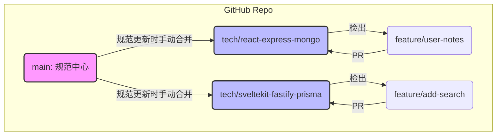

## **RepoVault: 项目完备性规范**

这份规范将作为所有技术栈分支（`tech/react-express-mongo`, `tech/sveltekit-fastify-prisma` 等）都必须遵守的“元规则”。

---


### **0. 核心原则**

1.  **一致性**: 无论采用何种技术栈，项目的结构、命名规范和交付流程都应保持高度一致。
2.  **自动化**: 任何可以自动化的环节（测试、检查、部署）都必须自动化。
3.  **清晰性**: 代码、提交、文档都应清晰易懂，降低沟通成本。
4.  **质量内建**: 质量是开发过程的一部分，而不是最后的检查环节。

---

### **1. 技术规范**

#### **1.1 编码规范**
-   **要求**: 每个技术栈分支**必须**采用其社区公认的最佳编码规范。
-   **自动化**:
    -   **格式化**: 必须配置自动代码格式化工具（如 Prettier for JS/TS, gofmt for Go, black for Python），并在 IDE 和 Git 提交钩子中集成。
    -   **静态分析**: 必须配置静态代码分析工具（如 ESLint for JS/TS, golangci-lint for Go, Flake8/Ruff for Python），用于检查潜在错误和不良实践。CI 流程必须运行此检查，不通过则无法合并。

#### **1.2 Git 提交规范**
-   **要求**: 所有分支**必须**遵循 [Conventional Commits](https://www.conventionalcommits.org/zh-hans/v1.0.0/) 规范。
-   **格式**: `<type>[optional scope]: <description>`
-   **常用类型**:
    -   `feat`: 新功能
    -   `fix`: 修复 bug
    -   `docs`: 文档变更
    -   `style`: 代码格式（不影响代码运行的变动）
    -   `refactor`: 重构（既不是新增功能，也不是修改bug的代码变动）
    -   `test`: 增加测试或修改测试
    -   `chore`: 构建过程或辅助工具的变动
-   **自动化**:
    -   必须使用 `commitlint` 和 `husky` 等工具，在 `git commit` 时自动校验提交信息格式。
    -   CI 流程应能根据提交类型自动生成变更日志。

---

### **2. 测试策略**

#### **2.1 测试金字塔**
-   **单元测试**: 70%
    -   **范围**: 测试独立的函数、类、组件。
    -   **要求**: 核心业务逻辑（如密码哈希、URL 解析、数据验证）的测试覆盖率**不得低于 90%**。所有测试必须与外部依赖（数据库、网络）隔离。
    -   **示例 (伪代码)**:
        ```javascript
        describe('UserService.register', () => {
          it('should throw an error if username is already taken', async () => {
            // Arrange: Mock the repository to return a user
            userRepository.findByUsername.mockResolvedValue(mockUser);
            // Act & Assert
            await expect(userService.register('existing-user', 'password'))
              .rejects.toThrow('Username already exists');
          });
        });
        ```
-   **集成测试**: 20%
    -   **范围**: 测试多个模块协同工作的能力（如 API 端点 -> Service -> Repository -> Database）。
    -   **要求**: 必须覆盖所有 API 端点的成功和失败场景。应使用真实的数据库（在 Docker 容器中运行）或内存数据库进行测试。
    -   **示例 (伪代码)**:
        ```javascript
        describe('POST /repos', () => {
          it('should return 201 and create a new repo item', async () => {
            // Arrange: Prepare a valid payload and auth token
            // Act: Make a real HTTP request to the API endpoint
            const response = await request(app)
              .post('/repos')
              .set('Authorization', `Bearer ${token}`)
              .send({ githubUrl: 'https://github.com/test/repo' });
            // Assert: Check response status and database state
            expect(response.status).toBe(201);
            expect(await db.item.count()).toBe(1);
          });
        });
        ```
-   **端到端测试**: 10%
    -   **范围**: 模拟真实用户操作，通过浏览器驱动完整业务流程。
    -   **要求**: 必须覆盖用户故事地图中的核心用户旅程（如“注册 -> 登录 -> 添加仓库 -> 查看列表”）。
    -   **工具**: 推荐使用 Playwright 或 Cypress。
    -   **示例 (伪代码)**:
        ```javascript
        test('user can add a repo to their collection', async ({ page }) => {
          // Act: Log in, add a repo
          await page.goto('/login');
          // ... fill login form and submit
          await page.goto('/');
          await page.fill('[data-testid="repo-url-input"]', 'https://github.com/microsoft/vscode');
          await page.click('[data-testid="add-repo-button"]');
          // Assert: Check if the new repo appears in the list
          await expect(page.locator('text=vscode')).toBeVisible();
        });
        ```
---

### **3. API 规范**

#### **3.1 规范与版本化**
-   **要求**: 所有 API 必须使用 **OpenAPI 3.x** 规范进行定义。API 文件（如 `openapi.yaml`）应位于 `docs/` 目录下。
-   **版本化**: 所有 API 路径**必须**包含版本号，如 `/api/v1/repos`。

#### **3.2 自动化工具链**
-   **Mock Server**:
    -   **要求**: 必须能根据 `openapi.yaml` 文件自动生成 Mock Server。
    -   **目的**: 前端开发可以在后端 API 未完成时并行进行。
    -   **工具**: 推荐 [Prism](https://stoplight.io/open-source/prism) 或 `msw`。
-   **类型生成**:
    -   **要求**: 如果前端使用 TypeScript，**必须**能从 `openapi.yaml` 自动生成 API 客户端和相关的 TypeScript 类型定义。
    -   **目的**: 消除前后端数据模型的不一致，实现端到端的类型安全。
    -   **工具**: 推荐 `openapi-typescript` 或 `orval`。
-   **交互式文档**:
    -   **要求**: 必须提供可交互的 API 文档站点。
    -   **工具**: 推荐 [Redoc](https://github.com/Redocly/redoc)。

---

### **4. 工作流**

#### **4.1 开发模式**
-   **推荐**: 对于核心业务逻辑（如认证、收藏逻辑），**推荐**采用 **TDD (测试驱动开发)** 模式。
-   **可选**: 对于复杂的用户交互场景，**可选**采用 **BDD (行为驱动开发)**，使用 Gherkin 语法编写可执行的需求规范。

#### **4.2 Git 工作流**
##### 模型
采用一种“主从式”的分支模型，以 `main` 分支为规范中心，各个 `tech/xxx` 分支为独立实现。
	- **`main` 分支 (宪法分支)**:
	    - **职责**: 存放项目所有技术栈无关的公共资产。
	    - **内容**: 顶层 `README.md`、`docs/` (API 设计、数据库规范)、`.gitignore`、本规范文档本身。
	    - **规则**: **禁止**直接合并任何 `tech/xxx` 分支的代码。它只接受直接提交或针对其本身的 PR。
	- **`tech/<frontend>-<backend>-<database>` 分支 (实现分支)**:
	    - **职责**: 一个完整、独立的全栈应用实现。
	    - **角色**: 每个分支都扮演着自己独立的 `main`/`develop` 分支角色。
	    - **规则**: 功能迭代、Bug 修复都在该分支内部进行。
##### 开发工作流

在一个具体的技术栈分支（例如 `tech/react-express-mongo`）上进行开发时，遵循以下流程：

1.  **切换到目标技术栈分支**:
    ```bash
    git checkout tech/react-express-mongo
    git pull origin tech/react-express-mongo # 确保是最新代码
    ```

2.  **创建功能分支**: 从当前技术栈分支创建新的功能分支。
    ```bash
    git checkout -b feature/user-notes
    ```

3.  **开发与提交**: 遵循编码规范和 Git 提交规范进行开发。

4.  **创建 Pull Request (PR)**:
    *   源分支: `feature/user-notes`
    *   目标分支: `tech/react-express-mongo`
    *   PR 必须通过所有自动化检查（CI）和代码审查。

5.  **合并与清理**: 合并 PR 到目标技术栈分支，并删除功能分支。



##### 项目维护

当 `main` 分支的公共规范（如 `.gitignore` 更新、`docs/` 内容变更）需要同步到所有技术栈分支时，维护者需要手动执行：

```bash
# 示例：同步 main 分支到 react-express-mongo 分支
git checkout tech/react-express-mongo
git pull origin tech/react-express-mongo
git merge main # 解决可能出现的冲突
git push origin tech/react-express-mongo
```

##### Pull Request (PR) 规范
-   每个 PR 必须关联至少一个用户故事或任务。
-   PR 描述必须清晰说明改动内容、如何测试以及相关截图（如有）。
-   PR 必须通过所有自动化检查（CI）。
-   每个 PR 必须至少经过一人代码审查。

---

### **5. 开发与运维实践**

#### **5.1 项目结构**
-   **要求**: 所有分支**必须**遵循统一的项目顶层结构：
    ```
    full-stack-lab/
    ├── frontend/          # 前端应用
    ├── backend/           # 后端应用
    ├── docs/              # 项目文档
    ├── scripts/           # 辅助脚本
    ├── docker-compose.yml # 本地开发环境
    └── README.md          # 该分支的说明文档
    ```

#### **5.2 环境管理**
-   **要求**: 必须明确区分 `development`, `staging`, `production` 三个环境。
-   **配置**: 使用 `.env` 文件管理环境变量。项目中必须包含 `.env.example` 文件作为模板，真实的环境变量文件（`.env`）必须被 `.gitignore` 忽略。

#### **5.3 容器化**
-   **要求**: 所有应用（前端、后端）和依赖服务（如数据库）**必须**提供 Dockerfile。
-   **开发**: 必须提供 `docker-compose.yml`，实现一条命令（`docker-compose up`）启动整个开发环境。

#### **5.4 CI/CD (持续集成/持续部署)**
-   **要求**: 必须配置 CI/CD 流水线（如 GitHub Actions）。
-   **CI 阶段**:
    -   代码检出
    -   运行静态代码分析
    -   运行所有测试（单元、集成）
    -   构建应用镜像
-   **CD 阶段**: **“一分支，一环境，一域名”**，确保每个技术栈都可以被独立访问和演示。

##### 环境与域名规划

| 技术栈分支 | Staging 环境 URL | Production 环境 URL (可选) | 触发条件 |
| :--- | :--- | :--- | :--- |
| `tech/react-express-mongo` | `https://react.repovault.demo` | `https://react.prod.repovault.demo` | 合并到 `tech/react-express-mongo` |
| `tech/sveltekit-fastify-prisma` | `https://svelte.repovault.demo` | `https://svelte.prod.repovault.demo` | 合并到 `tech/sveltekit-fastify-prisma` |
| `tech/vue3-go-gin-postgres` | `https://go.repovault.demo` | `https://go.prod.repovault.demo` | 合并到 `tech/vue3-go-gin-postgres` |

*   **Staging 环境**: 主要的演示和测试环境，每次 PR 合并到 `tech/xxx` 分支后自动部署。
*   **Production 环境 (可选)**: 用于展示稳定版本。可以通过创建 Git Tag（如 `v1.0.0-react`）来触发部署。

##### CI/CD 流水线设计

使用 GitHub Actions 是最佳选择。每个 `tech/xxx` 分支都应关联一个独立的部署 Workflow。

**Workflow 示例 (`.github/workflows/deploy-react.yml`)**:

```yaml
name: Deploy React Stack to Staging

on:
  push:
    branches:
      - 'tech/react-express-mongo' # 只在此分支有推送时触发

jobs:
  build-and-deploy:
    runs-on: ubuntu-latest
    steps:
      - name: Checkout code
        uses: actions/checkout@v3

      - name: Set up Docker Buildx
        uses: docker/setup-buildx-action@v2

      - name: Login to Container Registry
        uses: docker/login-action@v2
        with:
          registry: ghcr.io
          username: ${{ github.actor }}
          password: ${{ secrets.GITHUB_TOKEN }}

      - name: Build and push Docker images
        run: |
          docker build -t ghcr.io/${{ github.repository }}/frontend-react:latest -f Dockerfile.frontend .
          docker build -t ghcr.io/${{ github.repository }}/backend-express:latest -f Dockerfile.backend .
          docker push ghcr.io/${{ github.repository }}/frontend-react:latest
          docker push ghcr.io/${{ github.repository }}/backend-express:latest

      - name: Deploy to Staging Server
        uses: appleboy/ssh-action@v0.1.5
        with:
          host: ${{ secrets.STAGING_HOST }}
          username: ${{ secrets.STAGING_USER }}
          key: ${{ secrets.STAGING_SSH_KEY }}
          script: |
            cd /opt/repovault/react-staging
            docker-compose pull
            docker-compose up -d
            docker system prune -f
```

**说明**:
1.  **触发器**: `on.push.branches` 精确匹配了技术栈分支名。
2.  **构建**: 构建 Docker 镜像并推送到一个中央容器仓库（如 GitHub Container Registry）。
3.  **部署**: 通过 SSH 连接到部署服务器，拉取最新镜像并重启 `docker-compose` 服务。
4.  **隔离性**: 每个技术栈的 `docker-compose.yml` 和部署目录（`/opt/repovault/react-staging`, `/opt/repovault/svelte-staging`）都是独立的，避免了冲突。

#### **5.5 日志与监控**
-   **日志**: 应用日志**必须**是结构化的（推荐 JSON 格式），包含时间戳、日志级别、消息和上下文信息。
-   **监控**: 在 Staging 和 Production 环境中，**必须**集成日志聚合和性能监控工具（如 Grafana, Loki, Sentry）。
